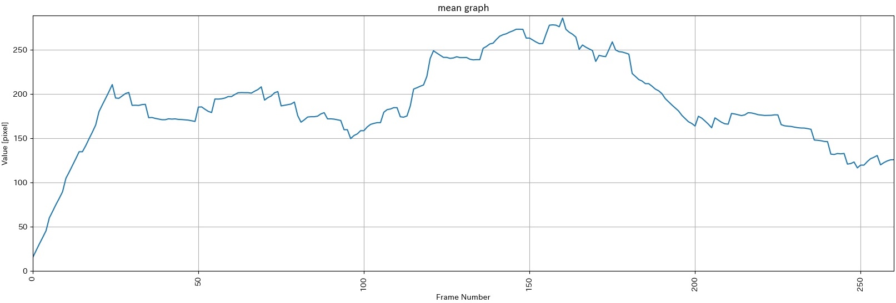
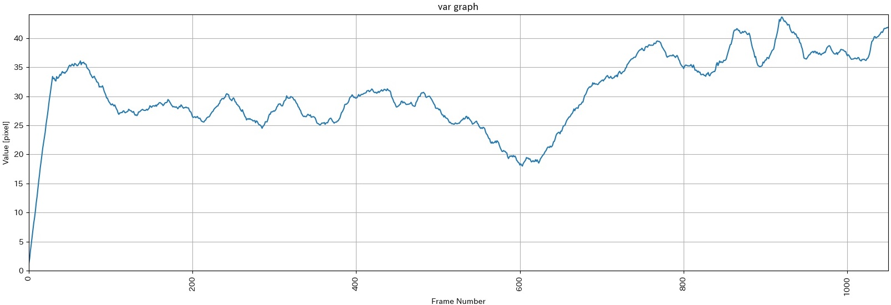
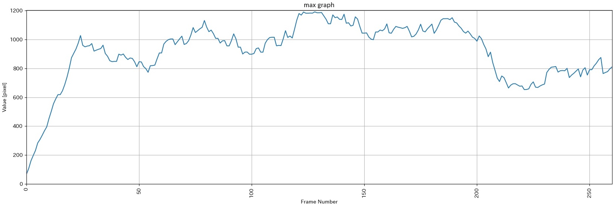

# Optical Flow Analysis
This repository calculates statistics value of movement by using saprse optical flow. 

## Workflow
```
# 1. Build docker environment
docker build -t optical_flow:latest .
docker run -it optical_flow /bin/bash

# 2. Compile file needed for execution.
make all

# 3. Run the compiled file and enter various paths 
# (input video file path, output statistics value path and output video path) 
# on the command line.
./main

# 4. Create a time series graph of calculated statistics.
python plot_data.py
```

## Demo


## Graph of Statistics Value



